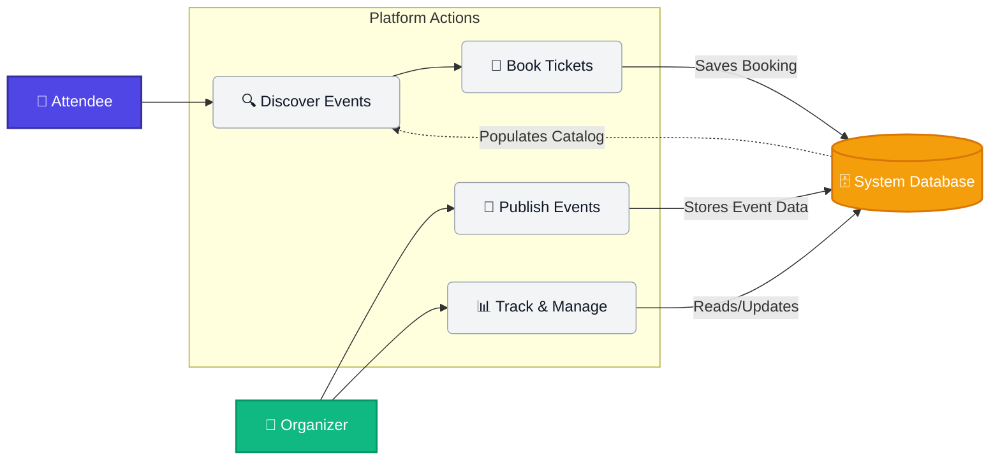

# 🌟 Lumina 🌟
*A modern, full-stack solution for discovering, booking, and managing events seamlessly.*

<!-- Badges -->
    

---

## 📖 Problem Statement

Organizing and discovering events is often a fragmented and frustrating experience. 
- **For Event Attendees**: Discovering relevant events, securely booking tickets, and keeping track of their upcoming schedule is spread across multiple platforms.
- **For Event Organizers**: Creating events, managing ticket sales, and reaching the right audience requires complex tools and high fees.

**Solution**: **Lumina** bridges the gap by providing a unified, intuitive, and secure environment where organizers can effortlessly publish events, and users can seamlessly discover and book them.

---

## 🎯 Minimum Viable Product (MVP)

The initial version of the platform includes the following core functionalities:

1. **User Authentication & Authorization**: Secure login and registration with Role-Based Access Control (RBAC) separating `Users` and `Organizers`.
2. **Event Discovery**: A landing page to browse all available events with basic details.
3. **Event Booking**: Users can view event details and book tickets securely.
4. **Attendee Dashboard**: A personalized space for users to view and manage their bookings.
5. **Organizer Dashboard**: Dedicated tools for organizers to create new events and monitor the events they host.

---

## 🛠 Tech Stack

Built with the modern **MERN** stack to ensure scalability, performance, and a smooth developer experience.

### **Frontend**
- **React.js (v19)**: Component-based UI development.
- **React Router (v7)**: Seamless client-side routing.
- **Framer Motion**: Fluid, beautiful micro-animations and transitions.
- **Lucide React**: Clean and consistent iconography.
- **Context API**: Global state management for Authentication and UI Toasts.

### **Backend**
- **Node.js & Express.js**: Fast and minimalist web framework for the API.
- **MongoDB & Mongoose**: Flexible NoSQL database and Object Data Modeling (ODM).
- **JWT (JSON Web Tokens)**: Secure stateless authentication.
- **Bcrypt.js**: Cryptographic password hashing.
- **Express Validator**: Robust request data validation.

---

## 🔄 Workflow Diagram



---

## 🚀 Getting Started

Follow these instructions to get a copy of the project up and running on your local machine for development and testing purposes.

### Prerequisites
- [Node.js](https://nodejs.org/) (v20.19 or higher; CI uses v24)
- [MongoDB](https://www.mongodb.com/) (Local instance or MongoDB Atlas cluster)

### Installation

1. **Clone the repository**
   ```bash
   git clone https://github.com/Cybercipher101/Lumina-Events.git
   cd Lumina-Events
   ```

2. **Install dependencies**
   ```bash
   npm ci
   ```

3. **Environment Setup**
   Generate a development configuration in the project root:
   ```bash
   npm run setup
   ```
   This creates `.env` with a private random JWT secret and the settings below. An existing `.env` is preserved. `npm run dev` also performs this setup automatically if `.env` is missing.
   ```env
   NODE_ENV=development
   API_PORT=5000
   FRONTEND_PORT=3000
   MONGO_URI=mongodb://127.0.0.1:27017/lumina
   JWT_SECRET=<generated by npm run setup>
   JWT_EXPIRE=30d
   ```
   Start your local MongoDB service before running the app. On Windows, open Services and start **MongoDB Server**, if installed as a service. If you use MongoDB Atlas, set `MONGO_URI` in `.env` to your existing cluster connection string and allow your machine's IP address in Atlas. A standalone MongoDB server is supported; this startup fix requires no database upgrade.

   For an existing `.env`, keep your connection string and secret. If the secret is missing, generate one with the command below, then copy its output into `JWT_SECRET` in `.env`. Keep that value private and do not commit `.env`.
   ```bash
   node -e "console.log(require('node:crypto').randomBytes(48).toString('hex'))"
   ```
   Older `.env` files using `PORT=5000` still work. `API_PORT` takes precedence, and the frontend always uses its separate `FRONTEND_PORT` (default `3000`).

4. **Run the Application**
   ```bash
   npm run dev
   ```
   The backend connects to MongoDB first. The frontend starts only after `/api/health` confirms readiness. Open the website address printed in the terminal; the browser does not open automatically.
   - **Frontend**: [http://localhost:3000](http://localhost:3000)
   - **Backend health**: [http://127.0.0.1:5000/api/health](http://127.0.0.1:5000/api/health)
   Keep this terminal running. Press Ctrl+C to stop both servers. Restart `npm run dev` after editing backend code or `.env`. `npm run server` and `npm start` can also run the backend and frontend separately.

### Signup/login proxy errors

`Could not proxy request /api/auth/register ... to http://localhost:5000 (ECONNREFUSED)` means the frontend cannot reach the backend. Check the backend terminal before retrying registration; the new startup flow reports the cause and keeps the frontend stopped until it is ready.

| Terminal message | Action |
| --- | --- |
| `Set MONGO_URI` or invalid connection string | Set your real MongoDB connection string in the project-root `.env`. |
| `Cannot reach MongoDB` | Start the local MongoDB service, or check Atlas network/IP access and connectivity. |
| `MongoDB authentication failed` | Check the database username/password in `MONGO_URI`; these differ from your Lumina account credentials. |
| Backend port already in use | Stop the other backend process or change `API_PORT`; the development proxy follows that setting automatically. |
| `Set JWT_SECRET` or invalid `JWT_EXPIRE` | Set a private random secret and a duration such as `30d` in `.env`. |

The LAN website address (for example `http://192.168.1.27:3000`) uses the same development proxy. The proxy connects to `127.0.0.1` on the machine running Node, avoiding IPv4/IPv6 differences with `localhost`. If the backend later becomes unavailable, the website displays a helpful JSON error instead of a Node.js documentation link.

### Verification

```bash
npm run test:server
npm run test:client -- --runInBand
npm run build
```

Server tests start a disposable standalone MongoDB and the complete development app to exercise registration, login, email normalization, invalid credentials, and expired sessions through the frontend proxy. They never connect to your configured database. The first test run downloads a MongoDB test binary. CI runs these checks and the Linux production build on changes to `main` and pull requests.

---

## 📂 Project Structure

```text
Lumina-Events/
├── public/                 # Static assets
├── server/                 # Backend Node.js/Express application
│   ├── config/             # Database connection & configurations
│   ├── middleware/         # Custom Express middlewares (Auth, Error handling)
│   ├── models/             # Mongoose schemas (User, Event, Booking)
│   ├── routes/             # API endpoints definitions
│   ├── seed/               # Database seeder scripts
│   └── server.js           # Backend entry point
├── src/                    # Frontend React application
│   ├── Components/         # Reusable UI components & layouts (case-sensitive)
│   ├── context/            # React Context (AuthContext, ToastContext)
│   ├── pages/              # Route-level components (Landing, Login, Dashboard)
│   ├── services/           # API interaction layer
│   ├── utils/              # Helper functions
│   ├── App.js              # Main React component & Router config
│   └── index.css           # Global styles
├── scripts/                # Development setup and process startup
├── .env                    # Private local configuration (not committed)
├── .env.example            # Configuration reference
└── package.json            # Project metadata and dependencies
```

---

<div align="center">
   <p>Built with ❤️ using the MERN Stack</p>
</div>
